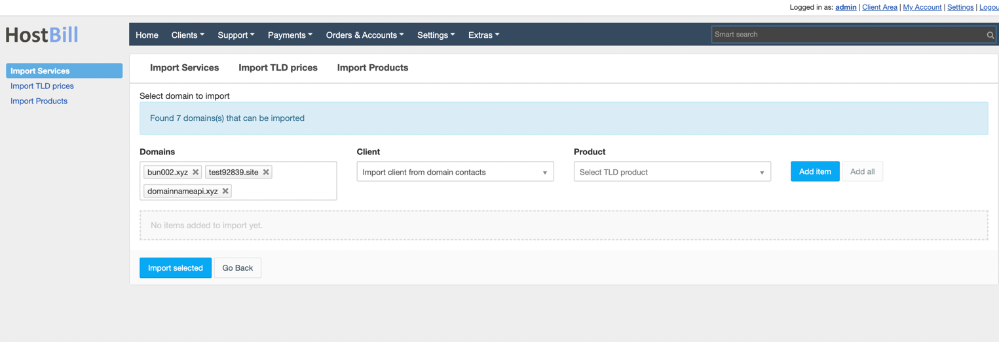
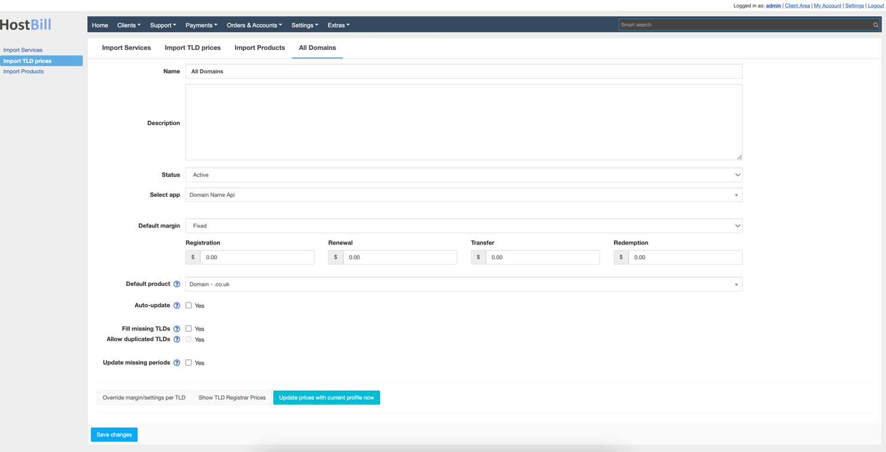
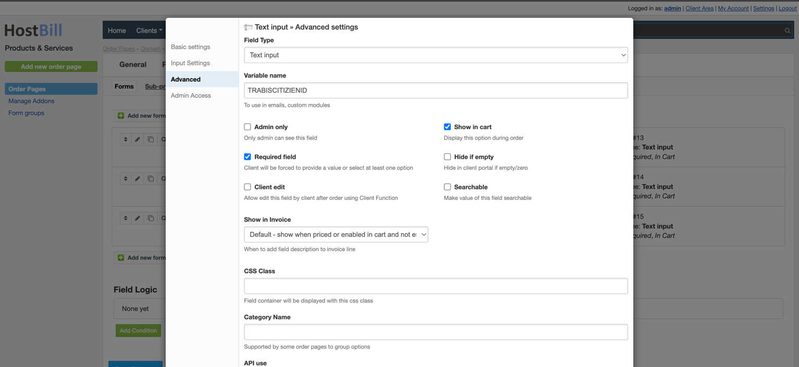

  
  <a href="README.md"   >   TR </a>  
  <a href="README-EN.md"> | EN </a>  
  <a href="README-AZ.md"> | AZ </a>  
  <a href="README-DE.md"> | DE </a>  
  <a href="README-FR.md"> | FR </a>  
  <a href="README-AR.md"> | AR </a>  
  <a href="README-CN.md"> | CN </a>  
  <a href="README-NL.md"> | NL </a>  

# لمحة عامة

**DomainNameApi** هو مسجل اسم النطاق الرائد الذي يوفر تسجيل اسم النطاق وخدمات أخرى عبر الإنترنت للشركات الصغيرة والمنزلية، والأفراد، ومجمعي الحركة، والموزعين. يتيح لك HostBill أتمتة تجهيز وإدارة النطاق **DomainNameApi**.

## تنشيط الوحدة
أولاً، تحتاج إلى تحميل الملفات إلى دليل HostBill الخاص بك:

لتنشيط الوحدة، قم بتسجيل الدخول إلى لوحة تحكم HostBill الإدارية، انتقل إلى الإعدادات → الوحدات → وحدات النطاق، ابحث واختر وحدة **DomainNameApi** وانقر فوق تنشيط.

## تكوين الوحدة

بمجرد تنشيط الوحدة، سيتم توجيهك إلى صفحة تكوين الوحدة. لتكوين الوحدة المفعلة، يمكنك أيضًا الانتقال إلى الإعدادات → التطبيقات → إضافة تطبيق جديد.

املأ حقول التكوين:

- اسم التطبيق
- اسم المستخدم
- كلمة المرور

ثم انتقل إلى إضافة خادم الأسماء الخاص بك:

- الخادم الأساسي للأسماء
- IP الخادم الأساسي للأسماء

استخدم تكوين الاختبار للتحقق من إمكانية اتصال HostBill.

انقر على إضافة تطبيق جديد.

# استيراد النطاق

انتقل إلى الإضافات -> استيراد -> استيراد الخدمات. يجب أن يظهر وحدة Domainnameapi في القائمة. حدده وانقر على متابعة.

سيتم عرض أسماء النطاقات. يمكنك مطابقة العملاء والمنتجات واستيرادها.

# تسعير النطاقات

انتقل إلى الإضافات -> استيراد -> أسعار TLD، قم بإنشاء ملف تعريف.
املأ الأسعار والإعدادات الأخرى بعناية.

# إعدادات استعلام النطاق

لتعيين إعدادات الاستعلام لامتداد، انتقل إلى علامة التبويب الإعدادات -> إعدادات النطاق.

عند تعديل الامتداد، اختر Domainnameapi كمحرك Whois وفحص الامتثال. بهذه الطريقة، سيتم إجراء استعلاماتك من خلال Domainnameapi بدلاً من خوادم whois العامة.
ملاحظة: لهذه العملية، تحتاج إلى إعادة تسمية الملف whois.custom.php.example في دليل Hostbill > includes > extend > whois إلى whois.custom.php.

# المتطلبات الأساسية لعملية تسجيل نطاق TR
انتقل إلى الإعدادات -> المنتجات -> اختر منتج النطاق الخاص بك، اختر تعديل نطاق *.tr. عندما تصل إلى علامة التبويب الإضافات، سترى تحذيراً حول حقول النطاق الإضافية. أضفها.

قم بتعديل جميع المعلومات باستثناء اسم المتغير حسب رغبتك، وقم أيضاً بإزالة علامة "مطلوب" في علامة التبويب "متقدم" (إذا لم تقم بذلك، سيتعين على العملاء ملء هذه الحقول أثناء تسجيل النطاق.)

