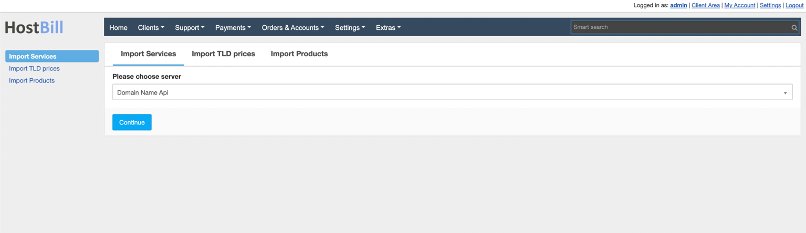
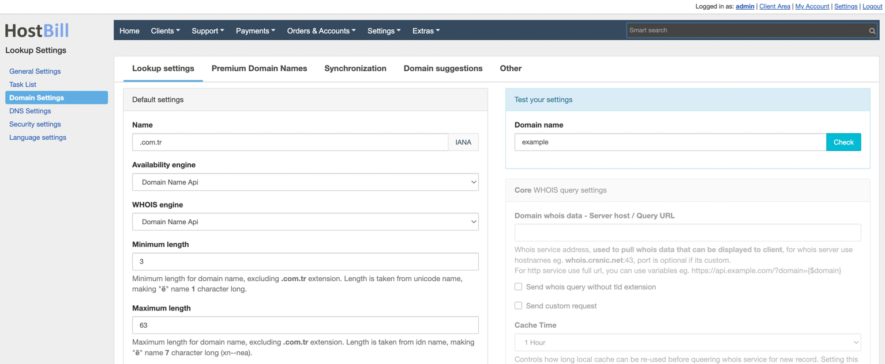

  
  <a href="README.md"   >   TR </a>  
  <a href="README-EN.md"> | EN </a>  
  <a href="README-AZ.md"> | AZ </a>  
  <a href="README-DE.md"> | DE </a>  
  <a href="README-FR.md"> | FR </a>  
  <a href="README-AR.md"> | AR </a>  
  <a href="README-CN.md"> | CN </a>  
  <a href="README-NL.md"> | NL </a>  

# 概述

**DomainNameApi** 是一家领先的域名注册商，为小型和家庭型企业、个人、流量聚合器和分销商提供域名注册和其他在线服务。HostBill允许您自动化**DomainNameApi**域名供应和管理。

## 激活模块
首先，您需要将文件上传到您的HostBill目录：

要激活模块，请登录您的HostBill管理员面板，进入设置 → 模块 → 域名模块，找到并选择**DomainNameApi**模块，然后点击激活。

## 模块配置

一旦你激活了这个模块，你会被重定向到模块配置页面。为了配置激活的模块，您也可以前往设置 → 应用程序 → 添加新应用程序。

填写配置字段：

- 应用程序名称
- 用户名
- 密码

然后继续添加您的域名服务器：

- 主域名服务器
- 主域名服务器IP

使用测试配置检查HostBill是否可以连接。

点击添加新应用程序。

# 域名导入

转到 附加功能 -> 导入 -> 导入服务。Domainnameapi 模块应该出现在列表中。选择它并点击继续。

域名将被列出。您可以匹配客户和产品并导入它们。

# 域名定价

转到 附加功能 -> 导入 -> TLD 价格，创建一个配置文件。
仔细填写费率和其他设置。

# 域名查询设置

要为扩展设置查询设置，请转到 设置 -> 域名设置 标签。

编辑扩展时，选择 Domainnameapi 作为 Whois 引擎和合规性检查。这样，您的查询将通过 Domainnameapi 而不是通用 whois 服务器进行。
注意：对于此操作，您需要将 Hostbill 目录 > includes > extend > whois 中的 whois.custom.php.example 文件重命名为 whois.custom.php。

# TR 域名注册流程的先决条件
转到 设置 -> 产品 -> 选择您的域名产品，选择编辑 *.tr 域名。当您到达扩展标签时，您将看到关于额外域名字段的警告。添加它。

根据需要编辑除变量名之外的所有信息，并在"高级"标签中删除"必需"标记（如果您不这样做，客户在域名注册过程中将不得不填写这些字段。）

