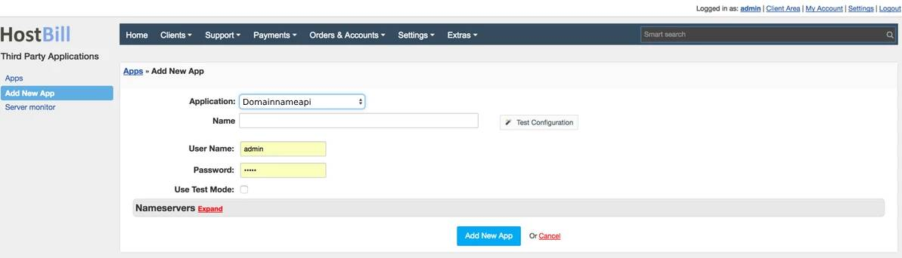
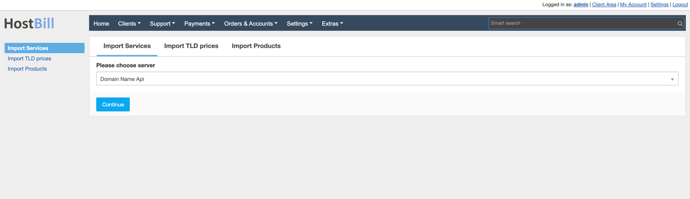
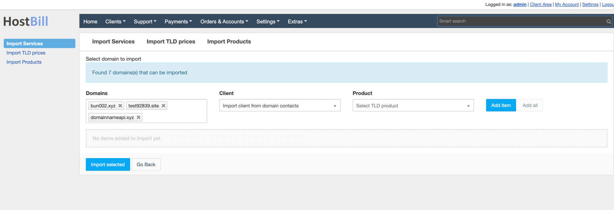
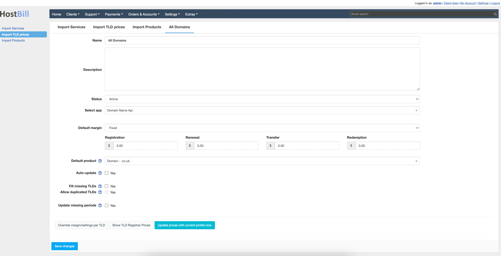
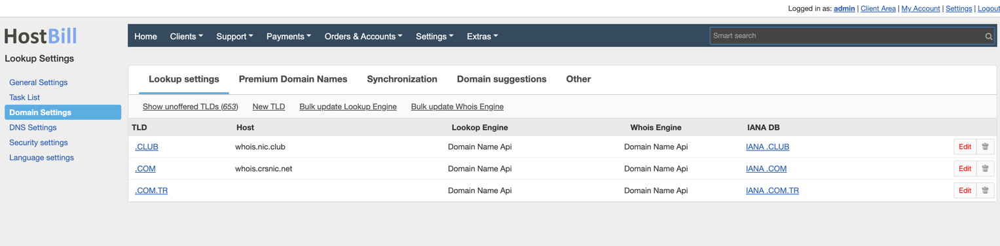
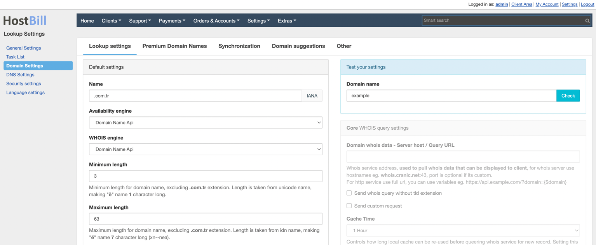
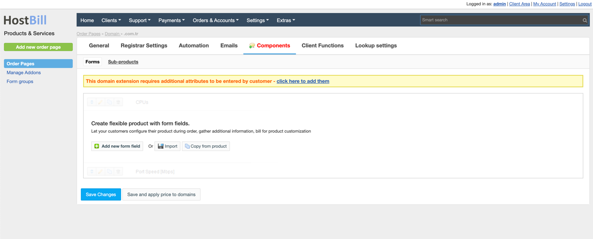
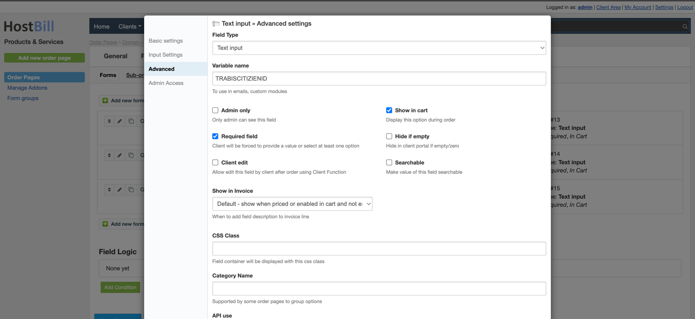

  
  <a href="README.md"   >   TR </a>  
  <a href="README-EN.md"> | EN </a>  
  <a href="README-AZ.md"> | AZ </a>  
  <a href="README-DE.md"> | DE </a>  
  <a href="README-FR.md"> | FR </a>  
  <a href="README-AR.md"> | AR </a>  
  <a href="README-CN.md"> | CN </a>  
  <a href="README-NL.md"> | NL </a>  

# Aperçu

**DomainNameApi** est un registraire de noms de domaine de premier plan qui fournit l'enregistrement de noms de domaine et d'autres services en ligne pour les petites entreprises, les entreprises à domicile, les individus, les agrégateurs de trafic et les revendeurs. HostBill vous permet d'automatiser la fourniture et la gestion de domaine **DomainNameApi**.

## 📦 Téléchargement — utilisez toujours les Releases !

⬇️ **Téléchargez la dernière version testée ici : https://github.com/domainreseller/hostbill-dna/releases/latest**

> ⚠️ N'utilisez **pas** le bouton vert **Code → Download ZIP** — il télécharge la branche de développement brute. Les paquets de release sont versionnés, testés et prêts pour la production.

## Activation du module
Tout d'abord, vous devez télécharger les fichiers dans votre répertoire HostBill:

Pour activer le module, connectez-vous à votre panneau d'administration HostBill, allez dans Paramètres → Modules → Modules de domaine, recherchez et choisissez le module **DomainNameApi** et cliquez sur Activer.

## Configuration du module

Une fois le module activé, vous serez redirigé vers la page de configuration du module. Pour configurer le module activé, vous pouvez également aller dans Paramètres → Applications → Ajouter une nouvelle application.

Remplissez les champs de configuration:

- Nom de l'application
- Nom d'utilisateur
- Mot de passe

Puis procédez à l'ajout de vos serveurs de noms:

- Serveur de noms primaire
- IP du serveur de noms primaire

Utilisez la configuration de test pour vérifier si HostBill peut se connecter.

Cliquez sur Ajouter une nouvelle application.

## 🔑 Identifiants API — Nom d'utilisateur/Mot de passe ou Reseller ID/API Key ?

Les deux sont pris en charge — saisissez-les dans les deux mêmes champs du module ; le module détecte automatiquement quelle API utiliser :

| Vous disposez de | Champ « Nom d'utilisateur » | Champ « Mot de passe » | API utilisée |
|---|---|---|---|
| **Nouveaux identifiants du panneau** (recommandé) | Reseller ID — UUID de la forme `xxxxxxxx-xxxx-xxxx-xxxx-xxxxxxxxxxxx` | API Key | REST |
| **Identifiants hérités (legacy)** | Nom d'utilisateur API | Mot de passe API | SOAP |

> 💡 Vous trouverez votre **Reseller ID** et votre **API Key** dans votre panneau DomainNameAPI, section **Paramètres API**.
> ⚠️ Ce sont des **identifiants API** — l'e-mail et le mot de passe de connexion à votre panneau ne fonctionneront **pas** ici.

Aucune configuration supplémentaire n'est nécessaire — si le champ nom d'utilisateur contient un UUID, le module utilise l'API REST moderne, sinon le SOAP classique.

# Importation de domaines

Allez dans Extras -> Importer -> Importer des services. Le module Domainnameapi devrait apparaître dans la liste. Sélectionnez-le et cliquez sur Continuer.

Les noms de domaine seront listés. Vous pouvez faire correspondre les clients et les produits et les importer.

# Tarification des domaines

Allez dans Extras -> Importer -> Prix TLD, Créez un profil.
Remplissez attentivement les tarifs et autres paramètres.

# Paramètres de requête de domaine

Pour définir les paramètres de requête pour une extension, allez dans l'onglet Paramètres -> Paramètres de domaine.

Lors de la modification de l'extension, sélectionnez Domainnameapi comme moteur Whois et vérification de conformité. Ainsi, vos requêtes seront effectuées via Domainnameapi au lieu des serveurs whois généraux.
Note : Pour cette opération, vous devez renommer le fichier whois.custom.php.example dans le répertoire Hostbill > includes > extend > whois en whois.custom.php.

# Prérequis pour le processus d'enregistrement de domaine TR
Allez dans Paramètres -> Produits -> Sélectionnez votre produit de domaine, sélectionnez pour modifier le domaine *.tr. Lorsque vous arrivez à l'onglet Extensions, vous verrez un avertissement concernant les champs de domaine supplémentaires. Ajoutez-le.

Modifiez toutes les informations sauf le nom de la variable selon vos souhaits, et supprimez également la case à cocher "Obligatoire" dans l'onglet "Avancé" (Si vous ne le faites pas, les clients devront remplir ces champs lors de l'enregistrement du domaine.)

