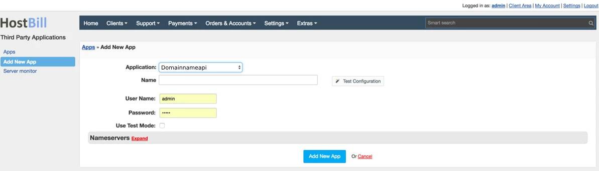

  
  <a href="README.md"   >   TR </a>  
  <a href="README-EN.md"> | EN </a>  
  <a href="README-AZ.md"> | AZ </a>  
  <a href="README-DE.md"> | DE </a>  
  <a href="README-FR.md"> | FR </a>  
  <a href="README-AR.md"> | AR </a>  
  <a href="README-NL.md"> | NL </a>  

# Overzicht

**DomainNameApi** is een toonaangevende domeinnaam registrar die domeinnaam registratie en andere online diensten levert aan kleine en thuisgebaseerde bedrijven, individuen, verkeersaggregatoren en wederverkopers. HostBill stelt u in staat om de **DomainNameApi** domeinprovisioning en -beheer te automatiseren.

## Het activeren van de module
Eerst moet u bestanden uploaden naar uw HostBill directory:

Om de module te activeren, logt u in op uw HostBill admin panel, gaat u naar Instellingen → Modules → Domein Modules, vindt en kiest u de **DomainNameApi** module en klikt u op Activeren.

## Module configuratie

Zodra u de module activeert, wordt u doorgestuurd naar de module configuratiepagina. Om de geactiveerde module te configureren, kunt u ook naar Instellingen → Apps → Nieuwe App toevoegen gaan.

Vul de configuratievelden in:

- Naam van de toepassing
- Gebruikersnaam
- Wachtwoord

Ga vervolgens verder met het toevoegen van uw nameservers:

- Primaire Nameserver
- Primaire Nameserver IP

Gebruik de Test Configuratie om te controleren of HostBill kan verbinden.

Klik op Nieuwe App toevoegen.
