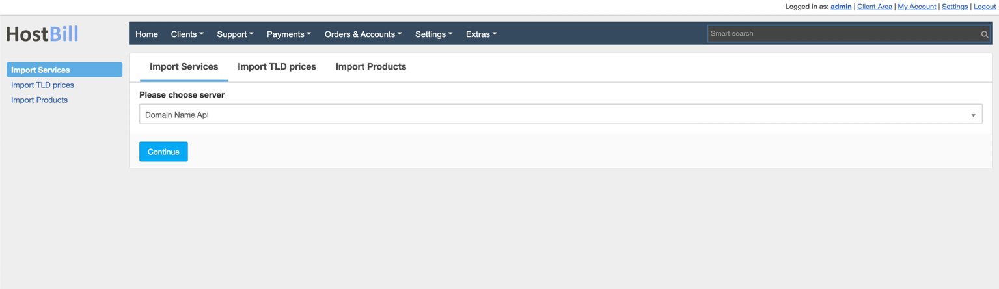
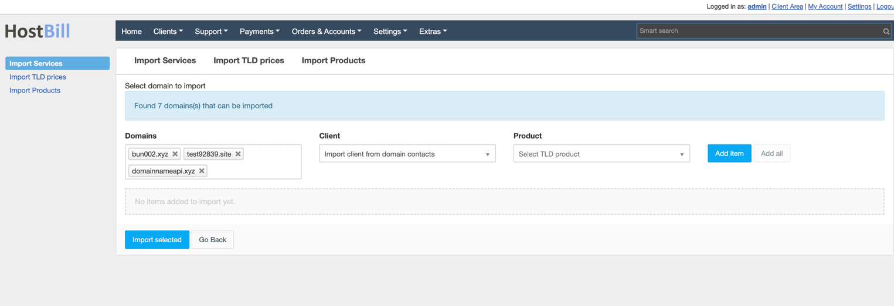
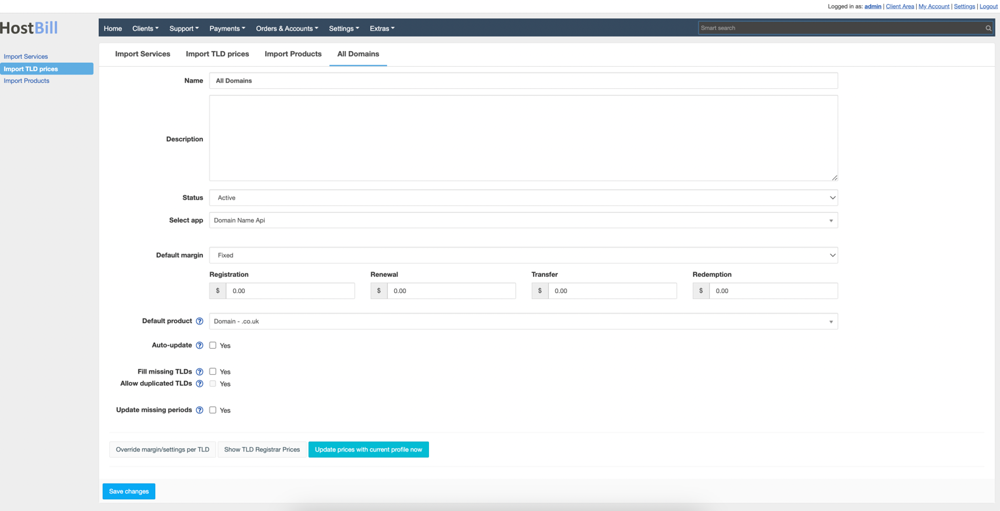
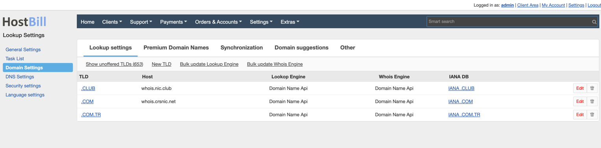
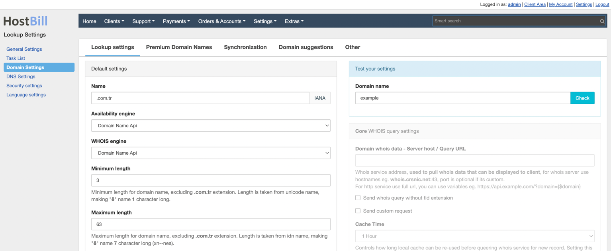
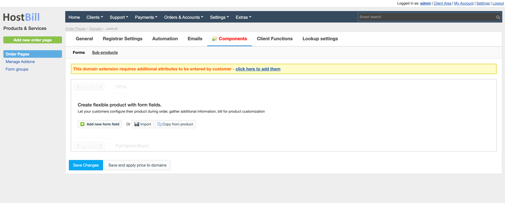
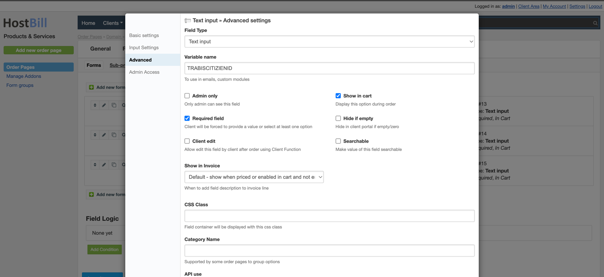

  
  <a href="README.md"   >   TR </a>  
  <a href="README-EN.md"> | EN </a>  
  <a href="README-AZ.md"> | AZ </a>  
  <a href="README-DE.md"> | DE </a>  
  <a href="README-FR.md"> | FR </a>  
  <a href="README-AR.md"> | AR </a>  
  <a href="README-CN.md"> | CN </a>  
  <a href="README-NL.md"> | NL </a>  

# Genel Bakış

**DomainNameApi**, küçük ve ev tabanlı işletmelere, bireylere, trafik toplayıcılara ve yeniden satıcılara alan adı kaydı ve diğer çevrimiçi hizmetler sağlayan önde gelen bir alan adı kayıt firmasıdır. HostBill, **DomainNameApi** alan adı oluşturma ve yönetimini otomatikleştirmenizi sağlar.

## Modülün Aktifleştirilmesi
Öncelikle dosyaları HostBill dizinine yüklemeniz gerekmektedir:

Modülü aktifleştirmek için HostBill yönetici panelinize giriş yapın, Ayarlar → Modüller → Alan Adı Modülleri'ne gidin, **DomainNameApi** modülünü bulun ve Aktifleştir'e tıklayın.

## Modül Konfigürasyonu

Modülü aktifleştirdikten sonra modül konfigürasyon sayfasına yönlendirilirsiniz. Aktifleştirilen modülü yapılandırmak için Ayarlar → Uygulamalar → Yeni Uygulama Ekle'ye de gidebilirsiniz.

Konfigürasyon alanlarını doldurun:

- Uygulamanın adı
- Kullanıcı adı
- Parola

Daha sonra nameserver'larınızı eklemeye geçin:

- Birincil Nameserver
- Birincil Nameserver IP

HostBill'in bağlanıp bağlanamadığını kontrol etmek için Test Konfigürasyonu'nu kullanın.

Yeni Uygulama Ekle'ye tıklayın.

# Alan adı içe aktarımı

Ekstralar -> İçeri aktar -> Servisleri içeri aktarı seçin. Domainnameapi modülü listede görünmelidir. Seçin ve Devam et butonuna basın.

Alan adları listelenecektir.  Müşteri ve ürün eşleştirip içe aktarım yapabilirsiniz

# Alan adları fiyatlandırması

Ekstralar -> İçeri aktar ->TLD fiyatlarını seçin, Bir profil oluşturun. 
Dikkatlice oranları ve diğer ayarları doldurun.

# Alan adı sorgulama ayarları

Bir uzantıya ait sorgulama ayarlarını yapmak için, Ayarlar->Alan adı ayarları sekmesine gidin gidin.

Uzantıyı düzelediğinizde Whois motoru ve Uygunluk kontrolünü Domainnameapi olarak seçin. Böylece sorgulamalarınız genel whois sunucularından değil, Domainnameapi üzerinden yapılacaktır.
Not: bu işlem için Hostbill Dizini > includes > extend > whois içindeki whois.custom.php.example dosyasının ismini whois.custom.php olarak değiştirmelisiniz.

# TR Alan adı kayıt işlemi için ön bilgiler
Ayarlar -> Ürünler-> Alan adı ürününüzü seçin, *.tr alan adını düzenlemeyş seçin. Eklentiler sekmesine geldiğinizde ek alan adı alanları uyarısı olduğunu göreceksiniz. Ekleyin.

Değişken adı haricindeki tüm bilgileri isteğinize göre düzenleyin, ayrıca "Gelişmiş" sekmesinde ki "Gerekli" işaretini kaldırın (Bunu yapmazsanız, müşteri alan adı kayıt işlemi sırasında bu alanları doldurmak zorunda kalacaktır.)
